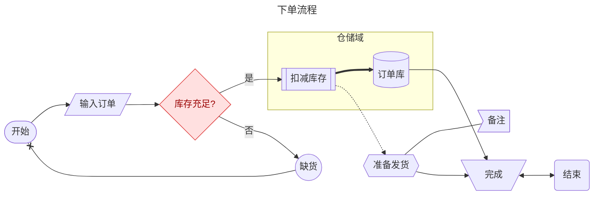
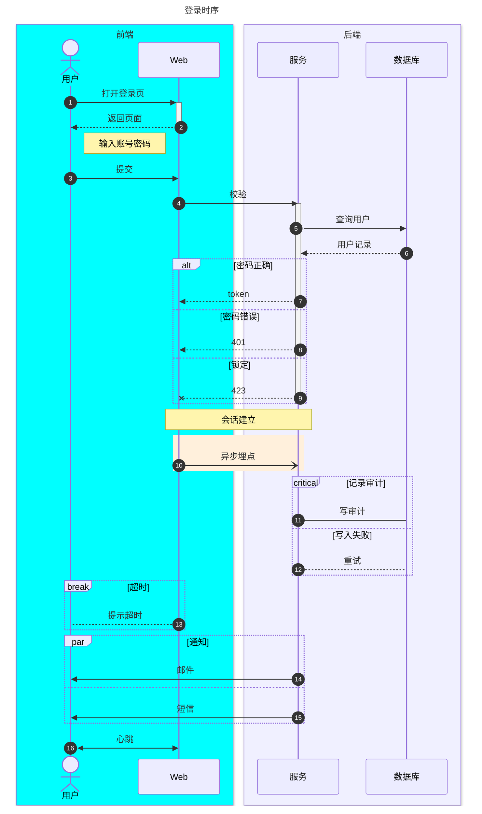
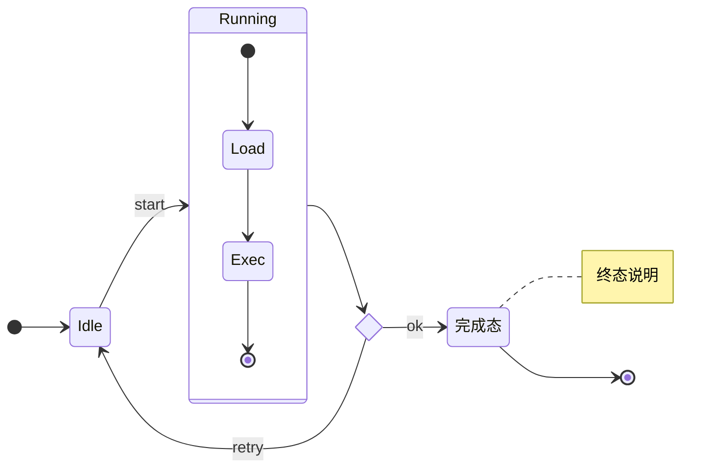
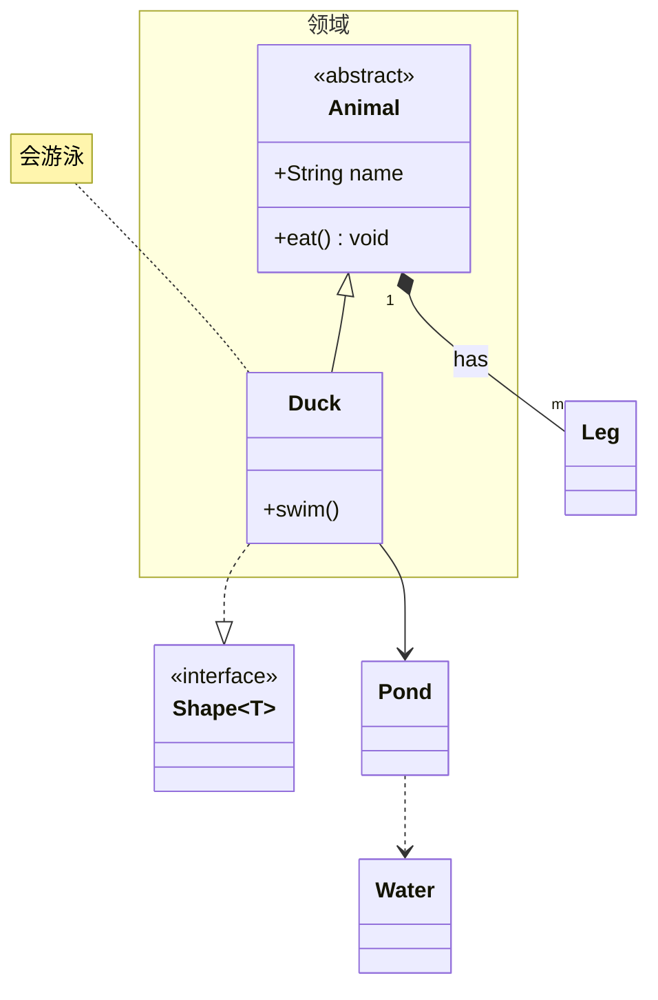

# Samples

```mermaid
---
title: 下单流程
---
flowchart LR
  A([开始]) --> B[/输入订单/]
  B --> C{库存充足?}
  C -- 是 --> D[[扣减库存]]
  C -->|否| E((缺货))
  D ==> F[(订单库)]
  D -.-> G{{准备发货}}
  G --- H>备注]
  F & G --> I[\完成/]
  E --x A
  I <--> J(结束)
  subgraph S1 [仓储域]
    D
    F
  end
  classDef hot fill:#ffe0e0,stroke:#d33,color:#900
  class C hot
  style E fill:#eef
```

```mermaid
sequenceDiagram
  title 登录时序
  autonumber
  box Aqua 前端
    actor U as 用户
    participant W as Web
  end
  box rgb(240,240,255) 后端
    participant S as 服务
    participant D as 数据库
  end
  U->>+W: 打开登录页
  W-->>-U: 返回页面
  Note right of U: 输入账号密码
  U->>W: 提交
  W->>S: 校验
  activate S
  S->>D: 查询用户
  D-->>S: 用户记录
  alt 密码正确
    S-->>W: token
  else 密码错误
    S-->>W: 401
  else 锁定
    S--xW: 423
  end
  deactivate S
  Note over W,S: 会话建立
  rect rgb(255, 240, 220)
    W-)S: 异步埋点
  end
  critical 记录审计
    S->D: 写审计
  option 写入失败
    S-->D: 重试
  end
  break 超时
    W-->U: 提示超时
  end
  par 通知
    S->>U: 邮件
  and
    S->>U: 短信
  end
  U<<->>W: 心跳
```

```mermaid
stateDiagram-v2
  direction LR
  [*] --> Idle
  Idle --> Running : start
  state Running {
    [*] --> Load
    Load --> Exec
    Exec --> [*]
  }
  state check <<choice>>
  Running --> check
  check --> Done : ok
  check --> Idle : retry
  Done : 完成态
  note right of Done : 终态说明
  Done --> [*]
```

```mermaid
classDiagram
  namespace 领域 {
    class Animal {
      <<abstract>>
      +String name
      +eat() void
    }
    class Duck
  }
  class Shape~T~
  <<interface>> Shape
  Animal <|-- Duck
  Duck : +swim()
  Animal "1" *-- "many" Leg : has
  Duck ..|> Shape
  Duck --> Pond
  Pond ..> Water
  note for Duck "会游泳"
```
